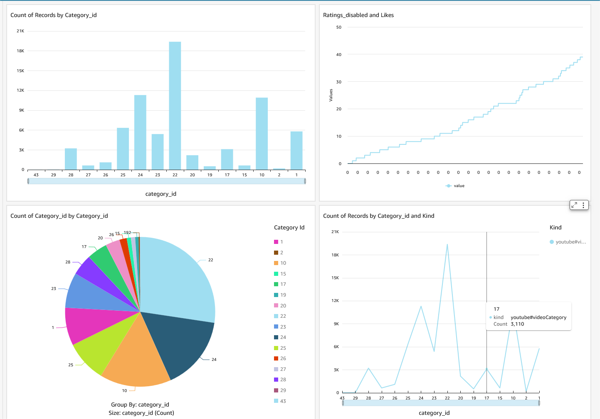
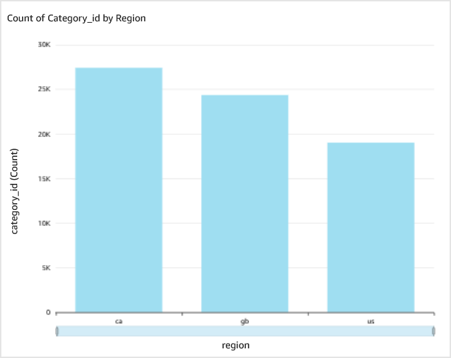
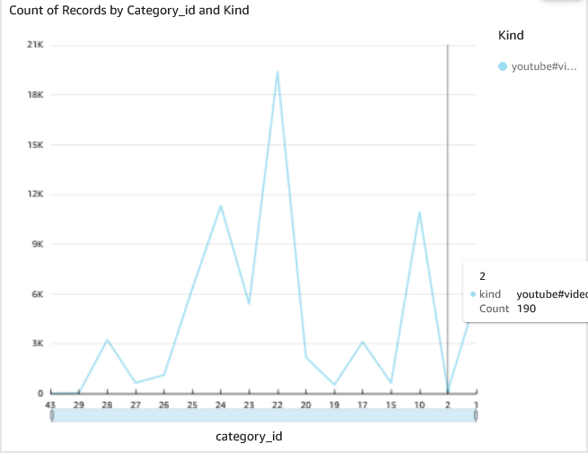

# 📊 YouTube Trending Videos Analysis  

  

## 📌 Overview  
YouTube (the world-famous video-sharing website) maintains a list of the **top trending videos** on the platform.  
According to Variety magazine:  

> *"To determine the year’s top-trending videos, YouTube uses a combination of factors, including measuring users' interactions (number of views, shares, comments, and likes). Note that they’re not the most-viewed videos overall for the calendar year."*  

This dataset provides a **daily record of the top trending YouTube videos** from multiple countries.  

---

## 📂 **Dataset Information**  

- 📅 **Time Frame:** Several months of data, updated regularly  
- 🌍 **Regions Included:**  
  - 🇺🇸 **USA**  
  - 🇬🇧 **Great Britain (GB)**  
  - 🇩🇪 **Germany (DE)**  
  - 🇨🇦 **Canada (CA)**  
  - 🇫🇷 **France (FR)**  
  - 🇷🇺 **Russia (RU)**  
  - 🇲🇽 **Mexico (MX)**  
  - 🇰🇷 **South Korea (KR)**  
  - 🇯🇵 **Japan (JP)**  
  - 🇮🇳 **India (IN)**  

Each region’s data is stored in a separate file containing up to **200 trending videos per day**.  

---

## 📌 **Data Fields**  

The dataset includes the following key features:  

| Column Name  | Description |
|-------------|------------|
| `video_id`  | Unique ID of the video |
| `title` | Title of the trending video |
| `channel_title` | Name of the video channel |
| `publish_time` | When the video was published |
| `views` | Total views on the video |
| `likes` | Total number of likes |
| `dislikes` | Total number of dislikes |
| `comment_count` | Number of comments |
| `tags` | Tags associated with the video |
| `category_id` | Category ID assigned by YouTube |
| `description` | Video description text |

📌 **Each region also includes a JSON file to map `category_id` to actual category names.**  

---

## 🏗 **Project Architecture**  

  

This architecture explains how data is collected, processed, and visualized in the analysis workflow.

---

## 📊 **Dashboard & Data Visualizations**  

### 🎯 **Full Dashboard View**  
  

### 📈 **Bar Graph View**  
  

### 📊 **Category-wise Continuous Graph**  
  

### 📊 **Data Analysis & Visual Insights**  

#### 1️⃣ **Top Trending Video Categories**  
  

#### 2️⃣ **Likes vs. Dislikes Trend**  
  

#### 3️⃣ **Video Views Over Time**  
*Analyzing how view counts change for trending videos over different periods.*  

#### 4️⃣ **Channel-Wise Popularity Analysis**  
*Identifying the top channels with the most trending videos.*  

#### 5️⃣ **Regional Video Performance Comparison**  
*Comparing video performance metrics like views, likes, and comment counts across different countries.*  

---

## 🚀 **How to Use This Repository?**  

1️⃣ Clone the repository:  
```sh
git clone https://github.com/your-username/YouTube-Trending-Analysis.git
